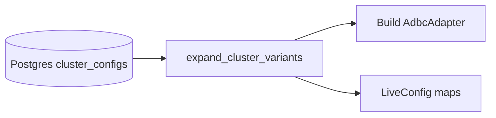
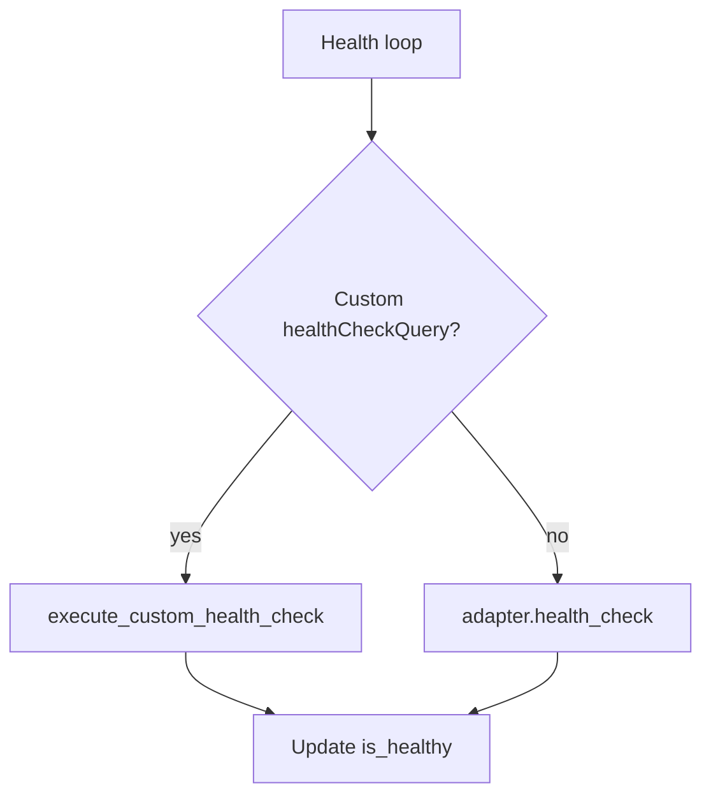
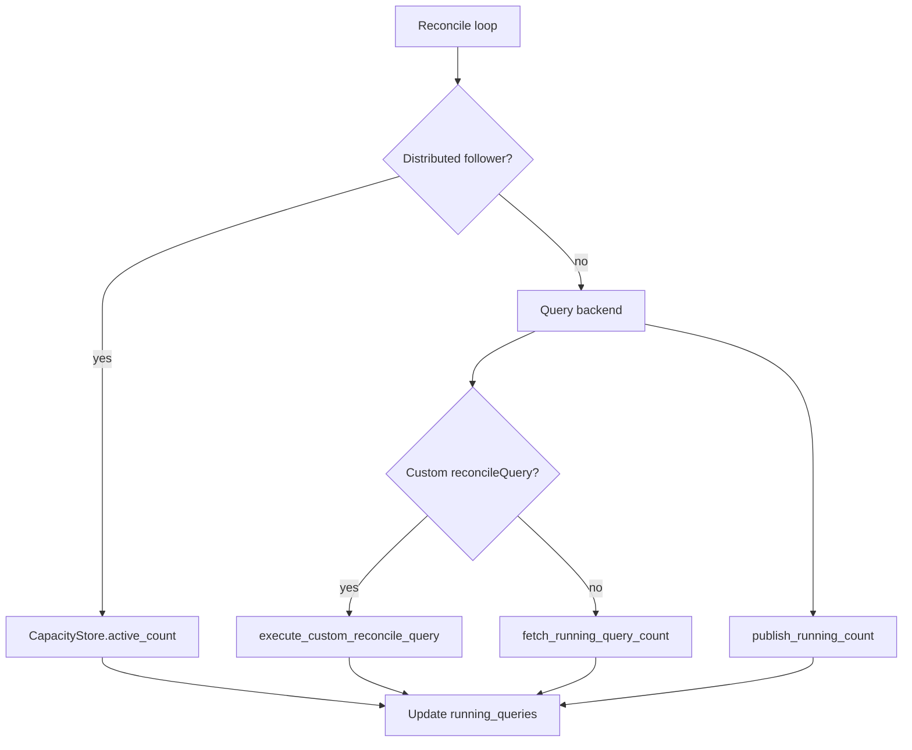

# Cluster variants, health checks, and reconciliation

QueryFlux can expand a **single persisted cluster config** into multiple **runtime clusters** (for example one Snowflake account with several warehouses). Each runtime cluster gets its own adapter, health/reconcile probes, and capacity tracking.

This page covers:

- **Cluster variants** — config-level expansion into `base::variant` runtime names
- **Health checks** — background probes every 30 seconds; unhealthy clusters are skipped by routing
- **Reconciliation** — syncing `running_queries` with backend ground truth every 30 seconds
- **Distributed mode** — fleet-wide admission via Postgres leases; reconcile publishes engine running counts to `cluster_capacity_counters.running`

For routing and group membership, see **[Routing and clusters](./routing-and-clusters)**.

---

## Cluster variants

### Problem

Without variants, each warehouse / SQL warehouse / BigQuery project needs a **separate cluster config** with duplicated credentials, TLS, and auth. Variants let you define shared connection settings once and list per-target overrides.

### Config shape

Variants are stored on the cluster record (Postgres `cluster_configs.variants` JSONB column, or YAML `variants:` on a cluster). Each variant has a `name` and `overrides` object that is deep-merged into the base `config`.

**YAML example (Snowflake):**

```yaml
clusters:
  my-snowflake:
    engine: adbc
    driver: snowflake
    uri: svc_user@myaccount/mydb/myschema
    auth:
      type: keyPair
      username: SVC_ACCOUNT
      privateKeyPem: "..."
    healthCheckQuery: "SHOW WAREHOUSES LIKE '{{sub_resource}}'"
    variants:
      - name: analytics
        overrides:
          warehouse: ANALYTICS_WH
      - name: etl
        overrides:
          warehouse: ETL_WH
          maxRunningQueries: 5
      - name: reporting
        overrides:
          warehouse: REPORTING_WH
```

**Admin API example:**

```json
PUT /admin/config/clusters/my-snowflake
{
  "engineKey": "adbc",
  "config": {
    "driver": "snowflake",
    "uri": "svc_user@myaccount/mydb/myschema"
  },
  "variants": [
    { "name": "analytics", "overrides": { "warehouse": "ANALYTICS_WH" } },
    { "name": "etl", "overrides": { "warehouse": "ETL_WH" } }
  ]
}
```

### Runtime expansion

At startup and on hot reload, `expand_cluster_variants()` in `queryflux-core` produces one runtime cluster per variant:

| Persisted name | Runtime clusters |
|---|---|
| `my-snowflake` (with 3 variants) | `my-snowflake::analytics`, `my-snowflake::etl`, `my-snowflake::reporting` |

**Naming:** `{base}::{variant_name}`. The `::` separator avoids `/`, which would break admin URL paths.

**Backward compatibility:**

- Clusters **without** variants behave exactly as before (single runtime cluster with the base name).
- Clusters **with** variants do **not** create a runtime cluster for the base name — only expanded names exist.

### Override mechanics

1. **Generic keys** in `overrides` are deep-merged into the base config JSON (for example `maxRunningQueries`, Athena `workgroup`).
2. **ADBC virtual fields** are also injected into `dbKwargs` using driver-specific mappings:

| Driver | Override key | `dbKwargs` key |
|---|---|---|
| Snowflake | `warehouse` | `adbc.snowflake.sql.warehouse` |
| Snowflake | `role` | `adbc.snowflake.sql.role` |
| Databricks | `httpPath` | `http_path` |
| BigQuery | `project` | `project_id` |
| Redshift | `workgroup` | `workgroup` |

### Group membership

Reference **expanded** names in `clusterGroups.members`:

```yaml
clusterGroups:
  snowflake-pool:
    maxRunningQueries: 20
    members:
      - my-snowflake::analytics
      - my-snowflake::etl
      - my-snowflake::reporting
```

In Studio, the group member picker may still list base cluster names — type expanded names (`base::variant`) manually when routing to a specific warehouse.

### Validation

- Variant names must be unique within a cluster and must not contain `::`.
- Expanded names must not collide with any other cluster name in the system (startup/reload fails with a clear error).

---

## Health checks and reconciliation

Two background loops in the QueryFlux binary run every **30 seconds** for each runtime cluster (including expanded variants). Both read from `LiveConfig.health_check_targets` and optional per-cluster custom SQL maps populated at reload.

### Optional config fields

Set on the **base** cluster config (inherited by all variants, with placeholder substitution):

| Field | JSON key | Purpose |
|---|---|---|
| Health check query | `healthCheckQuery` | SQL override for health probing |
| Reconcile query | `reconcileQuery` | SQL override returning one integer (running query count) |

**Placeholder:** `{{sub_resource}}` is replaced per variant with the resolved sub-resource name (warehouse, project, Databricks `httpPath`, etc.) during variant expansion.

Leave both fields **empty** to use **built-in defaults** (applied automatically at runtime — not stored in Postgres unless you save them explicitly):

| Driver | Default health | Default reconcile |
|---|---|---|
| Snowflake | `SHOW WAREHOUSES LIKE '{warehouse}'` | Same SHOW (reads `running` column) |
| BigQuery | Always healthy (no SQL) | `COUNT(*)` from `INFORMATION_SCHEMA.JOBS_BY_PROJECT` |
| Redshift | Always healthy | `SELECT COUNT(*) FROM stv_recents WHERE status = 'Running'` |
| Databricks | REST warehouse status | REST query history (no SQL defaults) |
| Trino / StarRocks / ClickHouse (ADBC) | `SELECT 1` | Engine-specific `COUNT` SQL |
| Native Trino / StarRocks | Adapter `SELECT 1` / health | System table `COUNT` SQL |

Custom `healthCheckQuery` / `reconcileQuery` **override** these defaults when set.

### Resolution order — health check

```
1. custom healthCheckQuery (if set)  →  execute via ADBC pool
2. adapter.health_check()            →  AdbcIntrospection or SELECT 1
```

Unhealthy clusters are excluded from `acquire_cluster` until the next successful probe.

### Resolution order — reconcile

Reconcile is **separate** from capacity admission. In distributed mode, `try_acquire` / `release` use Postgres leases only; they do not update `cluster_capacity_counters.running`.

```
1. Distributed + not sweep lock owner    →  read cluster_capacity_counters.running (CapacityStore::active_count)
2. Distributed + sweep lock owner        →  backend reconcile → publish_running_count → local state
3. Single instance                       →  backend reconcile → local state only
```

When `reconcileQuery` is omitted from persisted config, QueryFlux applies **driver-specific default SQL** before calling the backend (same queries as built-in introspection). Databricks remains REST-only (no SQL default).

If the local counter exceeds `max_running_queries`, it is reset to `actual.unwrap_or(0)` even when reconcile returns `None`.

### Built-in ADBC introspection

For SaaS ADBC drivers, QueryFlux avoids naive `SELECT 1` health checks that would **resume auto-suspending warehouses**. Driver-specific logic lives behind the `AdbcIntrospection` trait (`queryflux-engine-adapters/src/adbc/introspection.rs`).

| Driver | Default health | Default reconcile | Wakes compute? |
|---|---|---|---|
| **Databricks** | REST `GET /sql/warehouses/{id}` | REST query history API | No |
| **Snowflake** | `SHOW WAREHOUSES LIKE '{wh}'` → parse `state` | Same SHOW → parse `running` | No (cloud services) |
| **BigQuery** | Always healthy | `INFORMATION_SCHEMA.JOBS_BY_PROJECT` COUNT | No (metadata) |
| **Redshift** | Always healthy | `stv_recents` COUNT | Connects to leader |
| **Trino / StarRocks / ClickHouse** | `SELECT 1` | Built-in system-table SQL | Yes (self-hosted) |
| **Other ADBC** | `SELECT 1` | `None` (local counters only) | Depends |

Custom `healthCheckQuery` / `reconcileQuery` **override** runtime defaults when set explicitly in config.

### Recommended custom SQL (optional overrides)

| Backend | `healthCheckQuery` | `reconcileQuery` |
|---|---|---|
| Snowflake | `SHOW WAREHOUSES LIKE '{{sub_resource}}'` | Leave empty (built-in uses SHOW `running` column) |
| Databricks | Leave empty (REST) | Leave empty (REST) |
| BigQuery | Leave empty (always healthy) | Leave empty (JOBS_BY_PROJECT) |
| Redshift | Leave empty (always healthy) | Leave empty (`stv_recents`) |
| Trino / StarRocks | Leave empty (`SELECT 1`) | Leave empty (native adapter SQL) |

### Snowflake note

Built-in Snowflake introspection requires a **warehouse** in config (base or variant override). Without it, health falls back to `SELECT 1`, which can resume a suspended warehouse.

---

## Distributed mode and CapacityStore

When QueryFlux runs **multiple replicas** with `queryflux.distributed: true` and Postgres persistence:

### Capacity admission (`CapacityStore`)

Each query dispatch calls `try_acquire` / `release` on Postgres-backed **capacity leases** (`cluster_capacity_leases`). This enforces `max_running_queries` **across the fleet** for QueryFlux-routed queries only. Admission counts leases; it does not read `cluster_capacity_counters.running`.

### Engine reconcile (single-owner sweep)

Backend ground truth (Snowflake `SHOW WAREHOUSES`, BigQuery `JOBS_BY_PROJECT`, etc.) must **not** be queried by every replica — that would multiply load on auto-suspending warehouses.

Instead, every 30 seconds:

1. One replica acquires the **`engine-reconcile` sweep lock** (Postgres advisory lock, same mechanism as zombie eviction).
2. **Lock holder:** runs reconcile against **every** cluster (custom SQL or adapter introspection), publishes counts to `cluster_capacity_counters.running` in Postgres, and updates its local `ClusterState`.
3. **Other replicas:** skip backend calls; read the published counts from Postgres and update local `ClusterState`.

Prometheus utilization snapshots (every 5s) also read `cluster_capacity_counters.running` so all replicas expose the same backend ground truth in `/metrics`.

| Store / table | Source | Meaning |
|---|---|---|
| `cluster_capacity_leases` | `try_acquire` / `release` | QueryFlux admission slots fleet-wide |
| `cluster_capacity_counters.running` | Single-owner reconcile sweep | Backend warehouse/engine ground truth |

A Snowflake warehouse may report 40 running queries (dbt, BI, etc.) while QueryFlux only holds 3 capacity leases. Admission uses leases; routing visibility and reconcile use `running`.

See `CapacityStore` in the persistence crate (`active_lease_count`, `publish_running_count`, `active_count`).

### Postgres tables (distributed mode)

| Table / column | Updated by | Purpose |
|---|---|---|
| `cluster_capacity_leases` | `try_acquire`, `release`, `expire_stale`, shutdown | Fleet-wide QueryFlux admission slots |
| `cluster_capacity_counters.running` | Reconcile sweep (`publish_running_count`) | Engine running-query ground truth shared across replicas |

Schema: `crates/queryflux-persistence/src/postgres/migrations/20260611000001_distributed_coordination.sql`.

---

## Data flow

### Config load

On startup and on each config reload, persisted cluster rows expand into runtime adapters and live routing state:



### Health loop (every 30s)

Each runtime cluster is probed independently. Failed probes mark the cluster unhealthy and exclude it from routing until the next success.



### Reconcile loop (every 30s)

Reconcile syncs `ClusterState.running_queries` with backend ground truth. In distributed mode, only the sweep-lock holder queries backends; followers read `cluster_capacity_counters.running` from Postgres.



Admission (`try_acquire` / capacity leases) is **not** part of this loop — see [Distributed mode and CapacityStore](#distributed-mode-and-capacitystore).

---

## Studio and Admin API

### Studio

On **Add cluster** and **Edit cluster** for **ADBC** engines:

- **SaaS drivers** (Snowflake, Databricks, BigQuery, Redshift): structured **Warehouses** editor plus optional health/reconcile SQL
- **Other ADBC**: optional health/reconcile SQL only (variants via JSON on edit)

Fields map to `config.healthCheckQuery` and `config.reconcileQuery`. Empty fields are omitted on save (built-in defaults apply).

See **[QueryFlux Studio](../studio#managing-clusters)**.

### Admin API

| Endpoint | Variants / health fields |
|---|---|
| `GET /admin/config/clusters` | Lists persisted records including `variants` |
| `GET /admin/config/clusters/{name}` | Returns `config`, `variants` |
| `PUT /admin/config/clusters/{name}` | Accepts `variants`, `config.healthCheckQuery`, `config.reconcileQuery` |

After a write, the proxy hot-reloads adapters and custom query maps without restart.

---

## Related code

| Area | Location |
|---|---|
| Variant expansion | `crates/queryflux-core/src/config.rs` — `expand_cluster_variants()` |
| DB migration | `crates/queryflux-persistence/src/postgres/migrations/20260704000001_cluster_variants.sql` |
| Health / reconcile loops | `crates/queryflux/src/main.rs` |
| Custom query maps | `crates/queryflux-frontend/src/state.rs` — `LiveConfig` |
| ADBC introspection | `crates/queryflux-engine-adapters/src/adbc/introspection.rs` and driver modules |
| CapacityStore | `crates/queryflux-persistence/src/lib.rs` |
| Distributed coordination schema | `crates/queryflux-persistence/src/postgres/migrations/20260611000001_distributed_coordination.sql` |
| Studio forms | `queryflux-studio/components/add-cluster-dialog.tsx`, `app/clusters/clusters-grid.tsx` |
