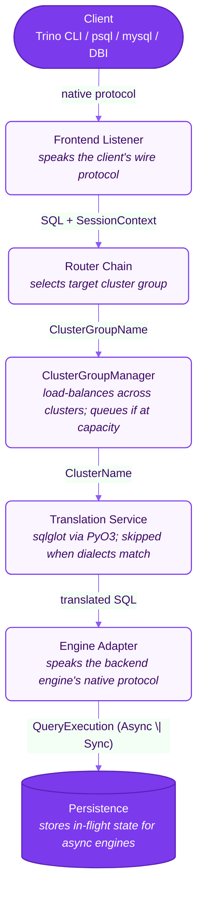
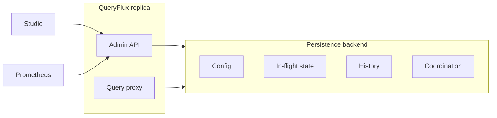

# QueryFlux — Architecture Overview

QueryFlux is a universal SQL query proxy and router. It accepts queries from clients over multiple protocols (Trino HTTP, PostgreSQL wire, MySQL wire, Arrow Flight SQL, and others), routes them to the appropriate backend engine, optionally translates the SQL dialect, and streams results back in the client's native format.

**More documentation:** the [architecture documentation overview](./overview.md) indexes deeper topics — [motivation-and-goals.md](motivation-and-goals.md) (why the project exists), [query-translation.md](query-translation.md) (sqlglot and dialects), [routing-and-clusters.md](routing-and-clusters.md) (routers, groups, load balancing), [cluster-variants-and-health.md](cluster-variants-and-health.md) (multi-warehouse variants, health/reconcile, distributed capacity), [observability.md](observability.md) (Prometheus, Grafana, Studio, Admin API), [adding-support/overview.md](adding-support/overview.md) (Extending QueryFlux — backend, frontend).

---

## High-level flow



| Step | Component | What happens |
|---|---|---|
| **① Client** | Any supported driver or CLI | Sends SQL over Trino HTTP, PostgreSQL wire, MySQL wire, Flight SQL, Snowflake, etc. |
| **② Frontend** | `queryflux-frontend` | Parses the wire protocol, builds `SessionContext`, hands SQL to dispatch. |
| **③ Router** | `queryflux-routing` | Evaluates the router chain; picks a **cluster group** (or falls back to `routingFallback`). |
| **④ Cluster manager** | `queryflux-cluster-manager` | Picks a healthy member cluster, enforces capacity (local counters or shared leases in distributed mode), may queue if the group is full. |
| **⑤ Translation** | `queryflux-translation` | Rewrites SQL when client dialect ≠ engine dialect; skipped when they already match. |
| **⑥ Engine** | `queryflux-engine-adapters` | Runs the query on Trino, DuckDB, StarRocks, Athena, or an ADBC SaaS warehouse. |

**After dispatch**, async engines (Trino, Athena) store an in-flight handle in the **persistence layer** so the client can poll until completion. Sync engines return results in one round trip.

**Result paths back to the client:**

| Path | When | Behavior |
|---|---|---|
| **Async poll** | Trino-style groups | Submit → persist handle → client polls proxy `nextUri` until done |
| **Sync Arrow** | Most frontend/backend pairs | Stream `RecordBatch`es, re-encode to the client protocol |
| **Sync native** | Matching wire formats (e.g. MySQL → StarRocks) | Stream driver-native chunks — no Arrow allocation |

The frontend never knows which engine ran the query. The adapter never knows which client protocol was used.

---

## Operations and persistence

QueryFlux separates **query traffic** (frontends, routing, engines) from **operational state** (config, in-flight queries, metrics history). Studio and Prometheus reach the **Admin API** on port `9000`; the query proxy uses the same process but different listeners.



**Persistence backends today:**

| Backend | Config | In-flight / queued queries | Query history | Multi-replica coordination |
|---|---|---|---|---|
| **In-memory** | YAML only (no Studio CRUD) | Per-process | Not persisted | Not available |
| **Postgres** | Hot-reload from DB + Studio | Shared across restarts | Studio dashboards | Optional (`distributed: true`) |

The **coordination** bucket (capacity leases, reconcile running counts, queue claims) is only used when a durable backend implements `DistributedBackendStore` — Postgres today. Single-replica Postgres deployments use config, state, and history only.

**Background tasks** (every replica, timers in `main.rs`):

| Task | Interval | Does |
|---|---|---|
| Config reload | 30s (configurable) | Re-read routing config when using a durable backend |
| Health check | 30s | Probe backends; mark clusters unhealthy |
| Reconcile | 30s | Sync running counts with engine ground truth; in distributed mode one leader publishes, others read |
| Metrics snapshot | 5s | Publish cluster utilization to Prometheus |

Distributed multi-replica details: **[Cluster variants, health checks & reconciliation](./cluster-variants-and-health.md#distributed-mode-and-capacitystore)**.

---

## Workspace Layout

```
queryflux/
├── crates/
│   ├── queryflux/                  # main binary — wires everything together
│   ├── queryflux-core/             # shared types: ProxyQueryId, SessionContext, QueryPollResult, …
│   ├── queryflux-config/           # ConfigProvider trait + YamlFileConfigProvider
│   ├── queryflux-frontend/         # FrontendListenerTrait + protocol implementations
│   ├── queryflux-engine-adapters/  # EngineAdapterTrait + per-engine implementations
│   ├── queryflux-routing/          # RouterTrait + RouterChain + all router implementations
│   ├── queryflux-cluster-manager/  # ClusterGroupManager: load balancing + queueing
│   ├── queryflux-persistence/      # Persistence + MetricsStore + ClusterConfigStore traits + impls
│   ├── queryflux-metrics/          # PrometheusMetrics, BufferedMetricsStore, MultiMetricsStore
│   ├── queryflux-translation/      # TranslatorTrait + SqlglotTranslator (PyO3)
│   ├── queryflux-auth/             # Authentication providers, authorization, identity resolution
│   ├── queryflux-fingerprint/      # Query fingerprinting (AST-based deduplication)
│   ├── queryflux-bench/            # Proxy overhead benchmarks (mock backends)
│   └── queryflux-e2e-tests/        # Integration tests
├── queryflux-studio/               # Next.js management UI (cluster monitoring, query history)
├── prometheus/                     # Prometheus scrape config
├── grafana/                        # Grafana provisioning + dashboards
├── docker/                         # Docker Compose files
│   ├── docker-compose.yml          # Local dev: Trino + Postgres + Prometheus + Grafana
│   └── test/docker-compose.test.yml  # E2E stack — full path `docker/test/docker-compose.test.yml`
├── config.local.yaml               # Example config for local development
└── Makefile                        # build / run / test shortcuts
```

---

## Core Abstractions

### SessionContext (`queryflux-core`)

Protocol-agnostic metadata that travels with a query from frontend through routing and into the engine adapter. Each frontend extracts the common fields at session initialization and places remaining protocol-specific key-value data into `extra`.

```rust
pub struct SessionContext {
    pub user:     Option<String>,
    pub database: Option<String>,
    pub tags:     QueryTags,
    /// Protocol-specific key-value bag. Key conventions:
    /// - Trino / ClickHouse HTTP: HTTP header names (lowercase) → values
    /// - Postgres wire: startup parameter names → values
    /// - MySQL wire: session variables → values
    pub extra:    HashMap<String, String>,
}
```

### QueryExecution (`queryflux-core`)

Engines fall into two models. The adapter declares which model it uses; dispatch handles both uniformly.

```
QueryExecution::Async { backend_query_id, next_uri, initial_body }
    → dispatcher stores handle in Persistence
    → client polls proxy until complete

QueryExecution::Sync { result: QueryPollResult }
    → dispatcher returns result immediately
    → no Persistence needed
```

| Engine | Model | Notes |
|---|---|---|
| Trino | Async | Submit → poll `nextUri` until done |
| DuckDB | Sync | Runs on `spawn_blocking`, result available immediately |
| StarRocks | Sync | MySQL protocol, single round-trip |
| ClickHouse | Sync | HTTP interface, `ArrowStream` response decoded to Arrow record batches |

### Engine adapters (`queryflux-engine-adapters`)

There is no single `EngineAdapterTrait`. Engines implement **`SyncAdapter`** (DuckDB, StarRocks, ClickHouse, ADBC) or **`AsyncAdapter`** (Trino, Athena).

```rust
// SyncAdapter — execute_as_arrow / optional execute_native
async fn cancel_query(&self, backend_id: &BackendQueryId) -> Result<()>; // default no-op

// AsyncAdapter — submit_query + poll_query
async fn cancel_query(&self, backend_id: &BackendQueryId) -> Result<()>; // required
```

On the sync path, dispatch holds a `SyncCancelGuard`. Adapters publish a `BackendQueryId` into a shared slot as soon as the engine id is known (before the blocking wait). If the client disconnects, the guard calls `cancel_query` (ClickHouse `KILL QUERY WHERE query_id = …`, StarRocks `KILL QUERY <connection_id>`, DuckDB `interrupt()`, Athena `StopQueryExecution`, Trino `DELETE /v1/query/{id}`). DuckDB HTTP and ADBC have no cross-thread kill API — cancel is a documented no-op; dropping the HTTP request is best-effort.

### RouterTrait (`queryflux-routing`)

```rust
pub trait RouterTrait: Send + Sync {
    fn type_name(&self) -> &'static str;
    async fn route(
        &self,
        sql: &str,
        session: &SessionContext,
        frontend_protocol: &FrontendProtocol,
    ) -> Result<Option<ClusterGroupName>>;
}
```

`RouterChain` evaluates routers in config order. First `Ok(Some(group))` wins. Falls back to `routingFallback` if every router returns `Ok(None)`. `route_with_trace` builds a `RoutingTrace` for debugging and observability.

---

## Implemented Components

### Frontends

| Protocol | Status | Port |
|---|---|---|
| Trino HTTP | **Done** | 8080 |
| PostgreSQL wire | **Done** | 5432 |
| MySQL wire | **Done** | 3306 |
| Arrow Flight SQL | **Done** (query execution) | — |
| Snowflake HTTP wire + SQL API v2 | **Done** | configurable (e.g. 8443) |
| Admin / Prometheus metrics | **Done** | 9000 |
| ClickHouse HTTP | Planned | 8123 |

**Trino HTTP routes:**

| Method | Path | Description |
|---|---|---|
| `POST` | `/v1/statement` | Submit a new query |
| `GET` | `/v1/statement/qf/queued/{id}/{seq}` | Poll a queued query (with backoff) |
| `GET` | `/v1/statement/qf/executing/{id}` | Poll an executing query |
| `DELETE` | `/v1/statement/qf/executing/{id}` | Cancel a running query |

### Engine Adapters

| Engine | Status | `ConnectionFormat` | Execution model |
|---|---|---|---|
| Trino (HTTP) | **Done** | `TrinoHttp` | Async — transparent `nextUri` proxying; raw bytes, zero copy |
| Trino (ADBC) | **Done** | `Arrow` | Sync — ADBC driver, Arrow result set |
| ADBC (Snowflake, Databricks, BigQuery, Redshift, …) | **Done** | `Arrow` | Sync — ADBC driver; built-in health/reconcile introspection for SaaS warehouses |
| DuckDB | **Done** | `Arrow` | Sync embedded — `spawn_blocking` + Arrow result set |
| StarRocks | **Done** | `MysqlWire` | Sync — `mysql_async` pool; native path (zero Arrow) for MySQL wire clients |
| Athena | **Done** | `Arrow` | Async AWS SDK — `StartQueryExecution` → poll → `GetQueryResults` |
| ClickHouse | **Done** | `Arrow` | Sync — HTTP interface (`default_format=ArrowStream`), Arrow result set |

### Routers

| Router | Matching criteria |
|---|---|
| `protocolBased` | Which frontend protocol the client used |
| `header` | HTTP header value (Trino HTTP only) |
| `queryRegex` | Regex patterns against SQL text |
| `tags` | Query tag key/value conditions (AND logic within a rule) |
| `pythonScript` | Custom Python function (`def route(query, ctx) -> str | None`) — see [routing-and-clusters.md](routing-and-clusters.md#python-script-router-pythonscript) |
| `compound` | Multiple conditions combined with `all` (AND) or `any` (OR) logic |

### Persistence

Persistence is pluggable behind traits in `queryflux-persistence` (`Persistence`, `MetricsStore`, `ClusterConfigStore`, `CapacityStore`, …). The binary wires an **in-memory** or **Postgres** implementation today.

| Backend | Status | Use case |
|---|---|---|
| In-memory (`DashMap`) | **Done** | Single-instance dev; config from YAML |
| PostgreSQL (JSONB) | **Done** | Durable config, query history, in-flight state, optional distributed coordination |
| Redis | Planned | Faster shared state; routing config would stay on the durable store |

**Distributed coordination** (`queryflux.distributed: true` + a backend that implements `DistributedBackendStore`, Postgres today): fleet-wide capacity leases, reconcile-published running counts, and queue claims. See **[Cluster variants, health checks & reconciliation](./cluster-variants-and-health.md#distributed-mode-and-capacitystore)**.

### Metrics

| Store | Status | Purpose |
|---|---|---|
| `PrometheusMetrics` | **Done** | Real-time operational metrics at `/metrics` |
| `NoopMetricsStore` | **Done** | Default — zero overhead |
| `PostgresStore` (MetricsStore) | **Done** | Historical query records for the management UI |
| `BufferedMetricsStore` | **Done** | Async write buffer wrapping any MetricsStore |

**Prometheus metrics exposed:**

| Metric | Type | Labels |
|---|---|---|
| `queryflux_queries_total` | Counter | `engine_type`, `cluster_group`, `status`, `protocol` |
| `queryflux_query_duration_seconds` | Histogram | `engine_type`, `cluster_group` |
| `queryflux_translated_queries_total` | Counter | `src_dialect`, `tgt_dialect` |
| `queryflux_running_queries` | Gauge | `cluster_group`, `cluster_name` | Running queries per cluster; in distributed mode reflects reconcile-published engine ground truth |
| `queryflux_queued_queries` | Gauge | `cluster_group` | Queries waiting for a free cluster slot |

---

## SQL Translation

Translation is handled by [sqlglot](https://github.com/tobymao/sqlglot) (Python, 31+ dialects) called via PyO3.

**When translation runs:** only when the incoming client dialect differs from the target engine's dialect. Trino client → Trino cluster = zero overhead passthrough.

**Two translation modes** (both implemented in `queryflux-translation`; see [query-translation.md](query-translation.md)):

1. **Dialect-only** (empty `SchemaContext`): `sqlglot.transpile(sql, read=src, write=tgt)` — this is what the main dispatch path uses today (`SchemaContext::default()`).
2. **Schema-aware** (non-empty `SchemaContext`): parse → `sqlglot.optimizer.optimize` with `MappingSchema` → emit in target dialect, with fallback to dialect-only if optimization fails.

Source dialect is inferred from the frontend protocol (`TrinoHttp` → Trino, `PostgresWire` → Postgres, etc.). Target dialect comes from the selected cluster’s **engine type** (via the adapter).

Translation gracefully degrades: if sqlglot is unavailable at startup, the service disables itself and SQL passes through untranslated.

---

## Configuration

```yaml
queryflux:
  externalAddress: http://localhost:8080
  frontends:
    trinoHttp:    { enabled: true,  port: 8080 }
    postgresWire: { enabled: false, port: 5432 }
    mysqlWire:    { enabled: false, port: 3306 }
    flightSql:    { enabled: false, port: 50051 }
  persistence:
    inMemory: {}     # or: postgres: { databaseUrl: "postgres://..." }
  adminApi:
    port: 9000

clusters:
  trino-1:
    engine: trino
    endpoint: http://trino:8080
    enabled: true
  duckdb-1:
    engine: duckDb
    enabled: true
    databasePath: /data/analytics.duckdb   # omit for in-memory

clusterGroups:
  trino-default:
    enabled: true
    maxRunningQueries: 100
    members: [trino-1]

  duckdb-local:
    enabled: true
    maxRunningQueries: 4
    members: [duckdb-1]

translation:
  errorOnUnsupported: false

routers:
  - type: protocolBased
    trinoHttp: trino-default

  - type: header
    headerName: X-Target-Engine
    headerValueToGroup:
      duckdb: duckdb-local

  - type: pythonScript
    script: |
      def route(query, ctx):
          if "big_table" in query:
              return "trino-default"
          return None

routingFallback: duckdb-local
```

---

## Local Development

### Prerequisites

- Rust (stable)
- Docker + Docker Compose
- Python 3.10+

### Setup

```bash
# Install Python dependencies (sqlglot)
make setup

# Export Python path for PyO3
export PYO3_PYTHON=$(pwd)/.venv/bin/python3

# Start backing services (Trino, Postgres, etc.)
make env
# In a separate terminal, run the proxy
make server
```

### Services

| Service | URL | Credentials |
|---|---|---|
| QueryFlux (Trino HTTP) | http://localhost:8080 | — |
| Prometheus metrics | http://localhost:9000/metrics | — |
| Trino (direct) | http://localhost:8081 | — |
| Prometheus | http://localhost:9090 | — |
| Grafana | http://localhost:3000 | admin / admin |
| PostgreSQL | localhost:5433 | queryflux / queryflux |

### Send a query

```bash
# Via Trino CLI
trino --server http://localhost:8080 --execute "SELECT 42"

# Via curl
curl -s -X POST http://localhost:8080/v1/statement \
  -H "X-Trino-User: dev" \
  -d "SELECT current_date"
```

---

## Roadmap

| Phase | Feature | Status |
|---|---|---|
| P1 | Trino HTTP frontend + DuckDB/Trino backends | **Done** |
| P1 | sqlglot translation (dialect-only) | **Done** |
| P1 | Prometheus metrics | **Done** |
| P1 | Postgres persistence + query history | **Done** |
| P1 | PostgreSQL wire frontend | **Done** |
| P1 | MySQL wire frontend + StarRocks backend | **Done** |
| P1 | Arrow Flight SQL frontend | **Done** |
| P1 | Snowflake HTTP wire + SQL API v2 frontend | **Done** |
| P1 | QueryFlux Studio — management UI | **Done** |
| P1 | Athena backend | **Done** |
| P1 | Authentication / authorization (`queryflux-auth`) | **Done** |
| P2 | Wire `SchemaContext` from catalog into dispatch | Planned |
| P3 | ClickHouse backend (HTTP, Arrow) | **Done** |
| P3 | ClickHouse HTTP frontend | Planned |
